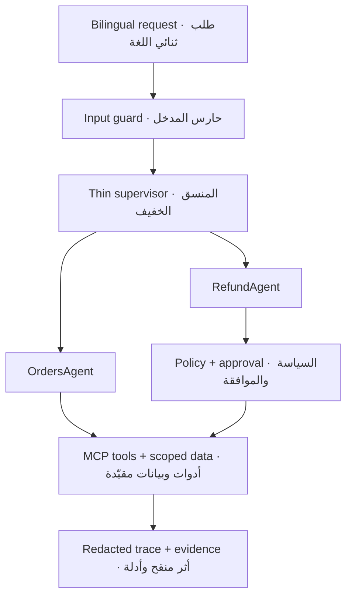

## Project scenario · سيناريو المشروع

A customer contacts the fictional delivery company **Tawseel** in Arabic or English to ask about an order or request a refund. Rafeeq detects the intent and order ID, verifies ownership through a scoped tool, retrieves only the active policy, delegates to the correct specialist, and records a redacted trace. Refunds require a delay greater than two days; amounts above SAR 500 pause for explicit human approval. Re-running a write remains safe through deterministic idempotency.

يتواصل عميل مع شركة التوصيل الافتراضية **توصيل** بالعربية أو الإنجليزية للسؤال عن طلب أو طلب استرداد. يحدد رفيق النية ورقم الطلب، ويتحقق من الملكية عبر أداة مقيّدة، ويسترجع السياسة السارية فقط، ويفوض المهمة للوكيل المتخصص، ويسجل أثرًا منقحًا. يشترط الاسترداد تأخرًا يزيد على يومين، وتتوقف المبالغ الأعلى من 500 ريال حتى تصدر موافقة بشرية صريحة. وتظل إعادة خلية الكتابة آمنة بفضل مفتاح منع التكرار الحتمي.

.

## Training-program attribution
This project was completed for the Rafeeq mini, delivered by SDAIA Academy three-day, on-site, 18-hour program. Session: September 2026.

all thanks to greates Trainer: [**Meaad Al-Marri**](https://github.com/almiyead-rgb)

Training-program reference:[SDAIA Academy on GitHub](https://github.com/SDAIAAcademy)
